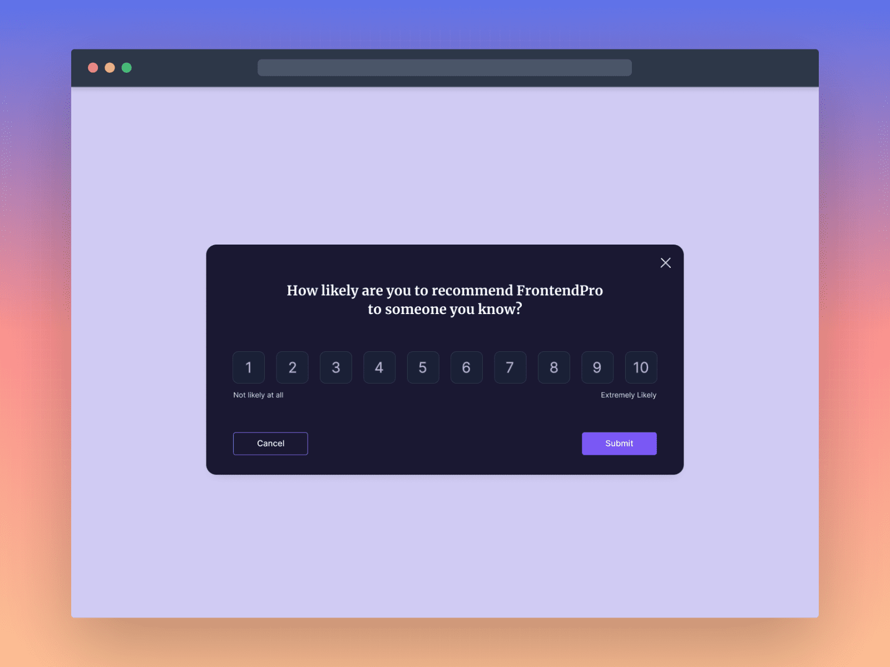

# Feedback Modal Component



A responsive feedback modal component built with HTML, CSS, and JavaScript. Allows users to rate products on a 1-10 scale.

## Features

- Interactive rating scale (1-10)
- Modal overlay with smooth animations
- Responsive design
- Cancel/Submit functionality
- Click outside to close
- Confirmation message on submit

## Technologies

- HTML5
- CSS3 (Flexbox, Transitions)
- JavaScript (ES6)
- No external dependencies

## Installation

1. Clone the repository:
```bash
git clone [text](https://github.com/Njuguna-Peter-njoroge)
```

2. Open `index.html` in your browser:
```bash
open index.html
```

## Usage

1. Click the "Give Feedback" button to open the modal
2. Select a rating (1-10)
3. Click "Submit" or press Enter
4. Modal will close and show confirmation

## Project Structure

```
feedback-modal-component/
├── design/                  # Design assets
├── src/
│   ├── style.css            # All styles
│   └── script.js            # Modal functionality
├── index.html               # Main HTML file
└── README.md                # Documentation
```

## Requirements

- [x] Modal triggered by button click
- [x] 1-10 rating scale
- [x] Close on submit/cancel/outside click
- [x] Responsive design
- [x] Visual feedback for selected rating

## Customization

To modify styles:
1. Edit colors in `style.css`
2. Adjust animations in `.modal-overlay` class
3. Change rating scale in `numbers` class

## License

MIT License
